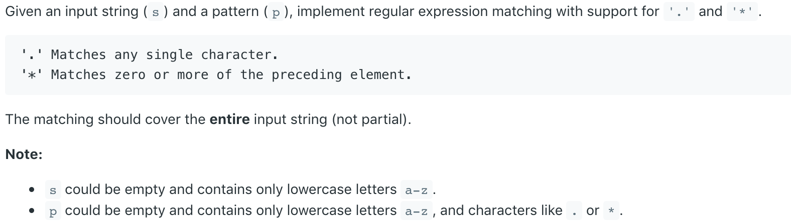
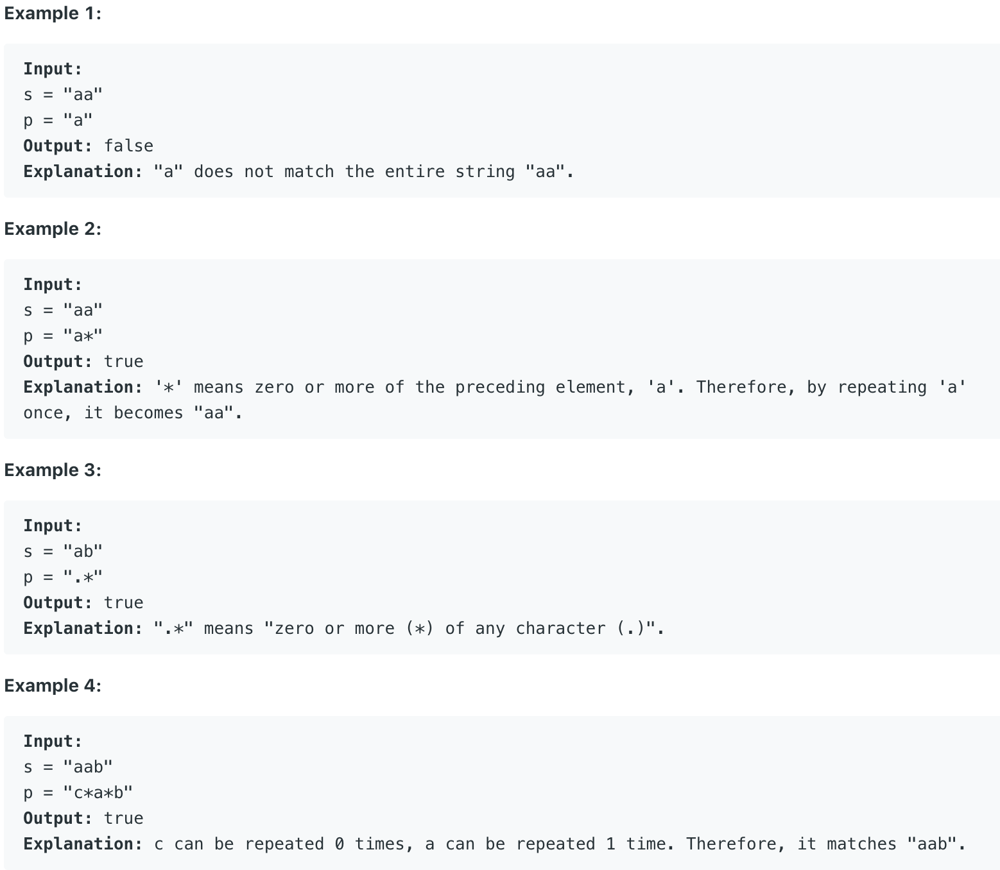
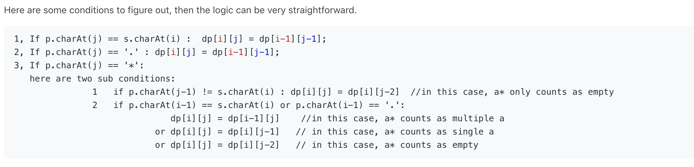

# 10.Regular Expression Matching \#





## 方法一：

可以用动态规划来处理正则表达式匹配问题。首先我们初始化一个二维数组dp。dp\[i\]\[j\]表示字符串从头到i的s字符串，是否匹配从头到j的p字符串。我们初始化dp\[0\]\[0\]为true，此外，我们需要用一个循环来处理p为a\*, a\*b\*等情况下的赋值。初始化完成之后，需要一步步计算得出dp数组的值。关于计算矩阵的值，有如下几种情况：



```text
public boolean isMatch(String s, String p) {
        // This is a dp solution. dp[i][j] is represents wether s to i is match with p to j
        if(s == null || p == null)
            return false;
        
        //Initiliaze dp array
        boolean[][] dp = new boolean[s.length() + 1][p.length() + 1];
        dp[0][0] = true;
        // Deals with the case of a*, a*b* .....
        for(int i = 0; i < p.length(); i++){
            if(p.charAt(i) == '*' && dp[0][i - 1])
                dp[0][i + 1] = true;
        }
        
        // Build the dp array
        for(int i = 0; i < s.length(); i++){
            for(int j = 0; j < p.length(); j++){
                if(p.charAt(j) == '.' || p.charAt(j) == s.charAt(i)){
                    dp[i + 1][j + 1] = dp[i][j];
                }
                else if(p.charAt(j) == '*'){
                    if(p.charAt(j - 1) != s.charAt(i) && p.charAt(j - 1) != '.'){
                        dp[i + 1][j + 1] = dp[i + 1][j - 1];
                    }
                    else{
                        dp[i + 1][j + 1] = dp[i+1][j] || dp[i][j+1] || dp[i+1][j-1];
                    }
                }
            }
        }
        
        return dp[s.length()][p.length()];
    }
```

**时间复杂度\(Time Complexity\) :** O\(m\*n\)          **空间复杂度\(Space Complexity\):** O\(m\*n\)

Runtime: 2 **ms**                                                  Memory Usage: **36.6 MB**

可通过这个视频对该方法进行更多了解：[https://www.youtube.com/watchv=l3hda49XcDE&index=17&list=PLrmLmBdmIlpsHaNTPP\_jHHDx\_os9ItYXr](https://www.youtube.com/watch?v=l3hda49XcDE&index=17&list=PLrmLmBdmIlpsHaNTPP_jHHDx_os9ItYXr)

