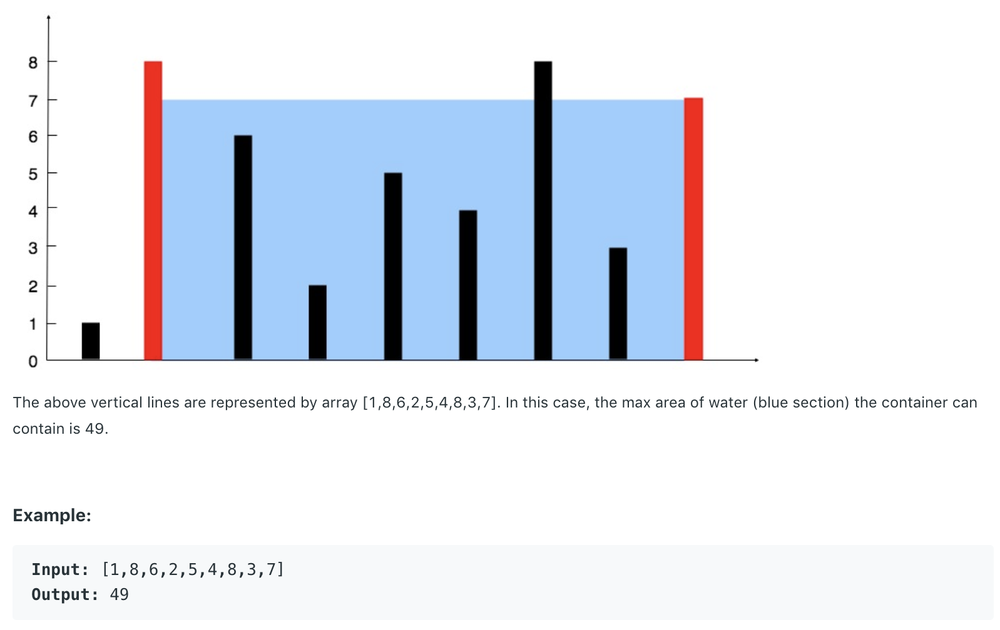

# 11.Container With Most Water

Given n non-negative integers a1, a2, ..., an , where each represents a point at coordinate \(i, ai\). n vertical lines are drawn such that the two endpoints of line i is at \(i, ai\) and \(i, 0\). Find two lines, which together with x-axis forms a container, such that the container contains the most water.

**Note:** You may not slant the container and n is at least 2.



给定一个数组，代表柱子高度。两根柱子之间的间距乘上相对较短那根柱子的高度为容器的容积。要根据数组求出最大容积。

## 方法一：暴力法

直接计算所有可能的结果，并逐一比较。将最后的结果存在Maxarea变量里。

```text
public int maxArea(int[] height) {
        int maxarea = 0;
        for (int i = 0; i < height.length; i++)
            for (int j = i + 1; j < height.length; j++)
                maxarea = Math.max(maxarea, Math.min(height[i], height[j]) * (j - i));
        return maxarea;
    }
```

**时间复杂度\(Time Complexity\) :** O\(n^2\)          **空间复杂度\(Space Complexity\):** O\(1\)

## 方法二：Two Pointers

用两个指针分别从数组的左右两端进行扫描，用一个cap变量储存最大的容器容量。当前所取得的最大容量受制于 1.两根柱子之间的间距 2.两根柱子中相对较矮的高度。随着两个指针从两边往中间扫描，间距必定变小。所以我们可以仅依据柱子高度来寻找更大的容量。取得当前最大容量后，两个指针分别指向两端的两根柱子。这时我们判断哪根柱子相对较短，移动指向较短柱子的指针，使其往中间靠。若两根柱子长度一样，则可移动任意一个指针。

```text
public int maxArea(int[] height) {
        int i = 0;
        int j = height.length - 1;
        int cap = 0;
        while(i < j){
            cap = Math.max(cap,(j - i) * Math.min(height[i], height[j]));
            if(height[i] < height[j]){
                i++;
            }
            else{
            j--;
            }
        } 
        return cap;    
    }
```

**时间复杂度\(Time Complexity\) :** O\(n\)          **空间复杂度\(Space Complexity\):** O\(1\)

