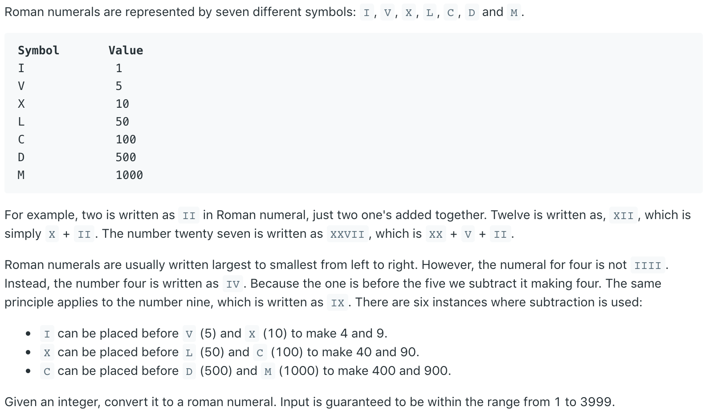
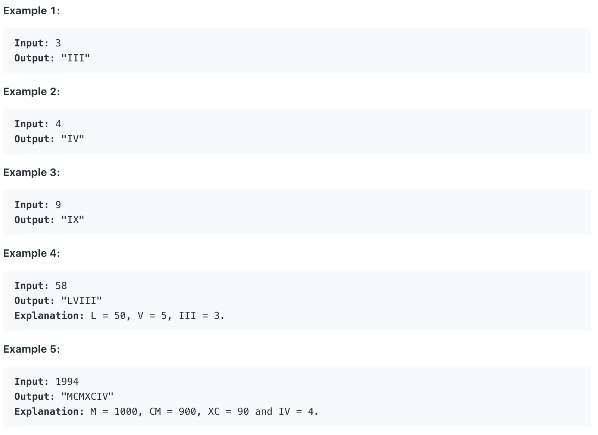

# 12.Integer to Roman \#





给出一个数字，要求将其转化为罗马数字，转化规则如上。

## 方法一：

```text
public String intToRoman(int num) {
        String M[] = {"", "M", "MM", "MMM"};
        String C[] = {"", "C", "CC", "CCC", "CD", "D", "DC", "DCC", "DCCC", "CM"};
        String X[] = {"", "X", "XX", "XXX", "XL", "L", "LX", "LXX", "LXXX", "XC"};
        String I[] = {"", "I", "II", "III", "IV", "V", "VI", "VII", "VIII", "IX"};
        return M[num/1000] + C[(num % 1000) / 100] + X[(num % 100) / 10] + I[num % 10];
    }
```

**时间复杂度\(Time Complexity\) :** O\(1\)          **空间复杂度\(Space Complexity\):** O\(1\)

