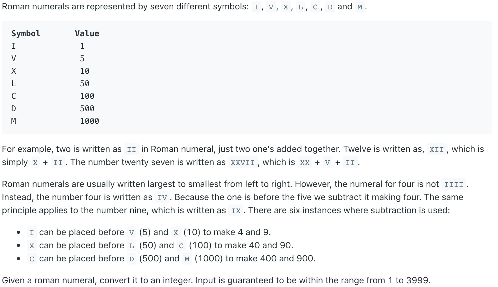
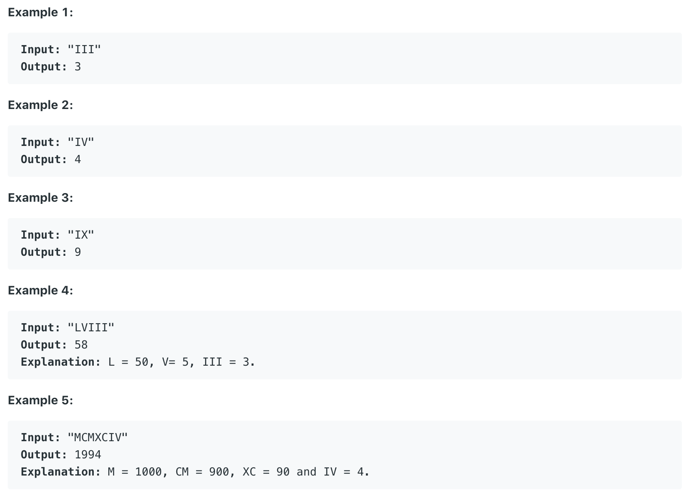

# 13.Roman to Integer \#





给定一个罗马数字，要求将其转换为阿拉伯数字。

## 方法一：

使用一个Hash Map来储存罗马字母到数字的映射。随后用一个for循环从数组尾端往前遍历数组。若当前字符所映射的值大于等于sum的值或者它与上一位的一样，则把它的值加到sum中。否则说明当前罗马字母位于比它的的罗马字母的左侧，应该用sum减去它的值。

```java
public int romanToInt(String s) {
        int len = s.length();
        int sum = 0;
        char[] chars = s.toCharArray();
        
        // Put all the alphabet to hashmap
        HashMap<Character,Integer> map = new HashMap<Character, Integer>();
        map.put('I',1);
        map.put('V',5);
        map.put('X',10);
        map.put('L',50);
        map.put('C',100);      
        map.put('D',500);
        map.put('M',1000);        
        
        // Traversals the string backward
        for(int i = len - 1; i >= 0; i--){
            if(map.get(chars[i]) >= sum || chars[i] == chars[i+1])
                sum += map.get(chars[i]);
            else
                sum -= map.get(chars[i]);
        }
        
        return sum;
}
```

**时间复杂度\(Time Complexity\) :** O\(n\)          **空间复杂度\(Space Complexity\):** O\(1\)

