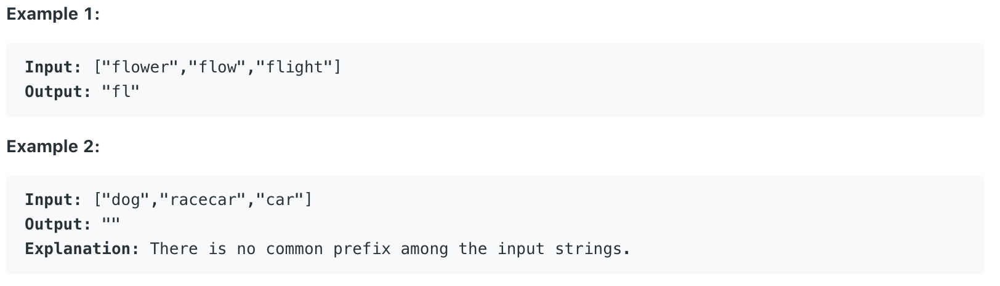

# 14.Longest Common Prefix

Write a function to find the longest common prefix string amongst an array of strings.

If there is no common prefix, return an empty string `""`.



给出一个字符串数组，要求返回这些字符串的共同最长前缀。

## 方法一：

因为最长的共同前缀不可能比任何一个字符串长，该方法的思路是先找到最短的那个字符串。并先假定最长共同前缀是这个最短的字符串。随后，我们遍历所有字符串。在每一次遍历中，我们需要确认当前字符串是否包含这个前缀，若不包含，我们删去当前前缀的最后一个字符，再进行判断。直到没有字符串包含当前前缀，或者前缀为空为止。

```java
public String longestCommonPrefix(String[] strs) {
        //Avoid empty input
        if(strs.length == 0 || strs == null){
            return "";
        }
        
        if (strs.length == 1) {
            return strs[0];
        }
        
        //Find the shorest string
        int i = 0;
        int j;
        int shortest = 0;
        int len = strs[i].length();
        for(j = 1; j < strs.length; j++){
            if(strs[j].length() < len){
                len = strs[j].length();
                shortest = j;
            }
        }
        
        //Find the longest common prefix
        String sub = strs[shortest];
        for(i = 0; i < strs.length; i++){
            while(strs[i].indexOf(sub) != 0){
                sub = sub.substring(0, sub.length()-1);
            }
        }
        return sub;
    }
```

**时间复杂度：**O\(n\*m\) 不是非常确定

## 方法二：

首先，我们使用Arrays.sort\(\)方法对字符串数组进行排序。该方法通过Java内置的Comparable&lt;T&gt;接口，根据字符串的ASCII值来进行排序。排序完成后，我们取首个和最后一个字符串，将它们逐位比较。若当前位字符相同，将该字符加入到StringBuilder中，否则跳出循环。最后返回StringBuilder的值。

```java
public String longestCommonPrefix(String[] strs) {
        // Handle empty string array and length of 1's array
        if(strs == null || strs.length == 0)
            return "";
        if(strs.length == 1)
            return strs[0];
        
        // Sort Strings by their value
        StringBuilder sb = new StringBuilder();
        Arrays.sort(strs);
        
        // Check common prefix between shortest and longest array
        char[] first = strs[0].toCharArray();
        char[] last = strs[strs.length - 1].toCharArray();
        for(int i = 0; i < first.length; i++){
            if(first[i] != last[i])
                break;
            else
                sb.append(first[i]);
        }
        return sb.toString();
    }
```

**时间复杂度：**O\(n\*logn\) 不是非常确定

