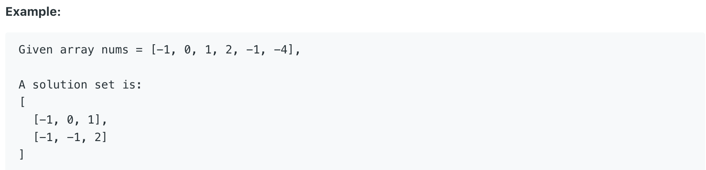

# 15.3Sum

Given an array `nums` of _n_ integers, are there elements _a_, _b_, _c_ in `nums` such that _a_ + _b_ + _c_ = 0? Find all unique triplets in the array which gives the sum of zero.

**Note:**

The solution set must not contain duplicate triplets.  




题目给出一个数组，要求找出所有和为0的三个数。

## 方法一：

首先对数组进行排序。随后定义三个整数i, j ,k。i和j从前往后扫描，k从后往前扫描。若三个数在数组中代表的整数和为0，将三个在数组中的数加入List里。详细实现代码如下：

```java
public List<List<Integer>> threeSum(int[] nums) {
        List<List<Integer>> res = new ArrayList<>();
        Arrays.sort(nums);
        for (int i = 0; i + 2 < nums.length; i++) {
            if (i > 0 && nums[i] == nums[i - 1]) {              // skip same result
                continue;
            }
            int j = i + 1, k = nums.length - 1;  
            int target = -nums[i];
            while (j < k) {
                if (nums[j] + nums[k] == target) {
                    res.add(Arrays.asList(nums[i], nums[j], nums[k]));
                    j++;
                    k--;
                    while (j < k && nums[j] == nums[j - 1]) j++;  // skip same result
                    while (j < k && nums[k] == nums[k + 1]) k--;  // skip same result
                } else if (nums[j] + nums[k] > target) {
                    k--;
                } else {
                    j++;
                }
            }
        }
        return res;
    }
```

**时间复杂度\(Time Complexity\) :** O\(nlogn\)          **空间复杂度\(Space Complexity\):** O\(n\)

