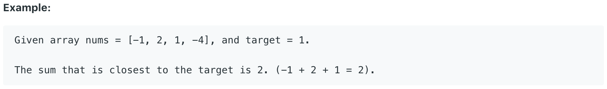

# 16.3Sum Closest \#

Given an array `nums` of _n_ integers and an integer `target`, find three integers in `nums` such that the sum is closest to `target`. Return the sum of the three integers. You may assume that each input would have exactly one solution.



给出一个target和一个数组，要求返回数与target最接近的三数之和。

## 方法一：

该方法与上一题基本一致。差别在于引入了一个dif变量来记录当前三数之和与target的差值。若遇到更小差值的三数之和，更新dif和sum的值。

```text
public int threeSumClosest(int[] nums, int target) {
        int dif = Integer.MAX_VALUE, sum = 0;
        Arrays.sort(nums);
        for (int i = 0; i < nums.length; i++) {
            int j = i + 1, k = nums.length - 1;  
            while (j < k) {
                if (Math.abs(nums[i] + nums[j] + nums[k] -target) < dif) {
                    sum = nums[i] + nums[j] + nums[k];
                    dif = Math.abs(sum - target);
                } else if (nums[i] + nums[j] + nums[k] > target) {
                    k--;
                } else {
                    j++;
                }
            }
        }
        return sum;
    }
```

**时间复杂度\(Time Complexity\) :** O\(nlogn\)          **空间复杂度\(Space Complexity\):** O\(1\)

