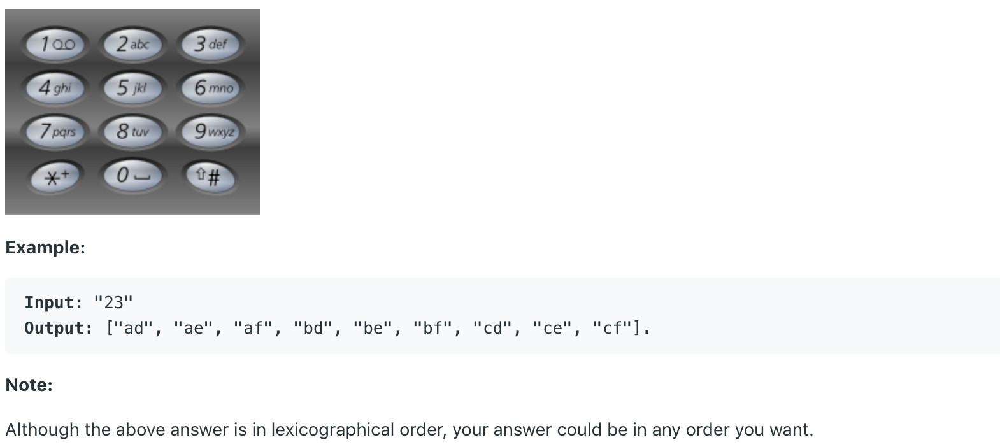

# 17.Letter Combinations of a Phone Number \#

Given a string containing digits from `2-9` inclusive, return all possible letter combinations that the number could represent.

A mapping of digit to letters \(just like on the telephone buttons\) is given below. Note that 1 does not map to any letters.



## 方法一：

先创建一个映射Map，将数字到字母的映射存入其中。之后将输入存入input数组。遍历input数组，将所有可能的结果赋值给ans。每次迭代，计算当前存在的所有字符串和当前数字能映射到的所有字母的组合。

```java
public List<String> letterCombinations(String digits) {
        List<String> ans = new ArrayList<String>();
        if(digits==null||digits.length()==0) return ans;
        char[][] map = new char[8][];
        map[0]="abc".toCharArray();
        map[1]="def".toCharArray();
        map[2]="ghi".toCharArray();
        map[3]="jkl".toCharArray();
        map[4]="mno".toCharArray();
        map[5]="pqrs".toCharArray();
        map[6]="tuv".toCharArray();
        map[7]="wxyz".toCharArray();

        char[] input = digits.toCharArray();
        ans.add("");
        for(char c:input)
            ans = expand(ans,map[c-'2']);
        return ans;
}
    
private List<String> expand(List<String> l,char[] arr){
    List<String> next = new ArrayList<String>();
    for(String s:l)
        for(char c:arr)
            next.add(s + c);
    return next;
}
```

**时间复杂度\(Time Complexity\) :**           **空间复杂度\(Space Complexity\):** 

