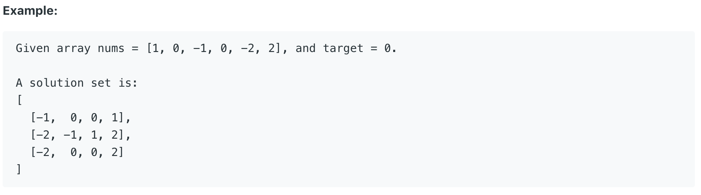

# 18. 4Sum \#

Given an array `nums` of _n_ integers and an integer `target`, are there elements _a_, _b_, _c_, and _d_ in `nums` such that _a_ + _b_ + _c_ + _d_ = `target`? Find all unique quadruplets in the array which gives the sum of `target`.



题目给出一个数组和一个target，要求返回所有和为target的四个数。数组中的数字会有重复。

## 方法一：

此方法基于3Sum，在3Sum外面加了一层循环。

```java
public List<List<Integer>> fourSum(int[] nums, int target) {
        List<List<Integer>> res = new ArrayList<>();
        Arrays.sort(nums);
        for(int i = 0; i < nums.length - 3; i++){
            if (i != 0 && nums[i] == nums[i - 1]) {              // skip same result
                continue;
            }
            for(int j = i + 1; j < nums.length - 2; j++){
                if (j != i + 1 && nums[j] == nums[j - 1]) {          // skip same result
                    continue;
                }
                int k = j + 1;
                int l = nums.length - 1;
                while(k < l){
                    if(nums[i] + nums[j] + nums[k] + nums[l] == target){
                        res.add(Arrays.asList(nums[i], nums[j], nums[k], nums[l]));
                        l--;
                        k++;
                        while (k < l && nums[k] == nums[k - 1]) k++;  // skip same result
                        while (k < l && nums[l] == nums[l + 1]) l--;  // skip same result
                    }
                    else if(nums[i] + nums[j] + nums[k] + nums[l] > target){
                        l--;
                    }
                    else{
                        k++;
                    }
                }
            }
        }
        return res;
    }
```

**时间复杂度\(Time Complexity\) :** O\(n^3\)          **空间复杂度\(Space Complexity\):** O\(n\)

