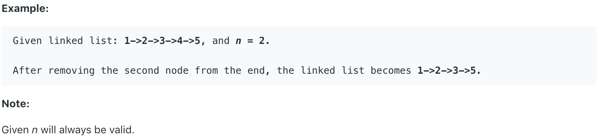

# 19.Remove Nth Node From End of List

Given a linked list, remove the _n_-th node from the end of list and return its head.



题目给出一个链表和一个数字N。要求删除从尾端开始数的第N个节点。

## 方法一：

由于我们不知道链表的长度。所以我们需要先遍历一遍链表，得知链表长度。随后，我们用链表长度减去N，从而得到应该删除节点的正序位置。之后再从头遍历一遍链表，遍历到该位置时，直接跳过，将指针指向下一个节点。

```java
public ListNode removeNthFromEnd(ListNode head, int n) {
        ListNode dummy = new ListNode(0);
        ListNode node = head;
        dummy.next = head;
        int len = 0;
        
        // Find the length of linked list
        while(node != null){
            len++;
            node = node.next;
        }
        
        // Define the location of the node want to remove
        // Let node point to dummy node
        len = len - n;
        node = dummy;
        
        // Move the pointer to the node previous to the node we want to remove
        while(len > 0){
            len--;
            node = node.next;
        }
        
        // Remove the node, and return the linked list
        node.next = node.next.next;
        return dummy.next;
    }
```

**时间复杂度\(Time Complexity\) :** O\(n\)          **空间复杂度\(Space Complexity\):** O\(1\)

## 方法二：

该方法使用两个指针来遍历链表。两个指针遍历速度相同，其中一个指针先行，一个后行。使它们中间固定相隔N个节点。当先行的指针到达链表尾部时，后行指针遍历至该删除节点的前一节点。此时将它的指针直接指向下下个节点，即可完成删除。

```text
public ListNode removeNthFromEnd(ListNode head, int n) {
    ListNode start = new ListNode(0);
    ListNode slow = start, fast = start;
    slow.next = head;
    
    //Move fast in front so that the gap between slow and fast becomes n
    for(int i=1; i<=n+1; i++)   {
        fast = fast.next;
    }
    //Move fast to the end, maintaining the gap
    while(fast != null) {
        slow = slow.next;
        fast = fast.next;
    }
    //Skip the desired node
    slow.next = slow.next.next;
    return start.next;
}
```

**时间复杂度\(Time Complexity\) :** O\(n\)          **空间复杂度\(Space Complexity\):** O\(1\)

## 方法三：

第一次遍历链表确定长度的时候，顺便把每个结点存到数组里。然后直接通过数组删除相应节点，时间换空间。如果需要多次删除从尾端开始数的第N个元素，则该方法可以大幅优化运行时间。

```java
public ListNode removeNthFromEnd(ListNode head, int n) {
    // Put nodes in to list, and count the length of the linked list
    List<ListNode> l = new ArrayList<ListNode>();
    ListNode h = head;
    int len = 0;
    while (h != null) {
        l.add(h);
        h = h.next;
        len++;
    }
    
    // Return null when the linked list's length is 1.
    if (len == 1) {
        return null;
    }
    
    // Remove first node if the value of remove is 0
    int remove = len - n;
    if (remove == 0) {
        return head.next;
    }
    
    // Remove the node by reference tp index of ArrayList.
    ListNode r = l.get(remove - 1);
    r.next = r.next.next;
    return head;
}
```

**时间复杂度\(Time Complexity\) :** O\(n\)          **空间复杂度\(Space Complexity\):** O\(n\)

