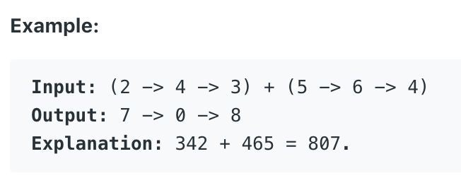

# 2.Add Two Number \#

You are given two **non-empty** linked lists representing two non-negative integers. The digits are stored in **reverse order**and each of their nodes contain a single digit. Add the two numbers and return it as a linked list.

You may assume the two numbers do not contain any leading zero, except the number 0 itself.



本题输入两个非空的链表，链表的每个节点包含了非负整数。链表中的数字以逆序储存。目标是求两个链表的和，并以一个链表的形式返回。

## 方法一：基本数学法

就像是我们学习过的小学数学一样，我们用进位法来处理这个问题。用一个整型变量carry来表示进位，该变量只有0和1两个值。我们初始化carry为0\(因为计算刚开始时不存在进位\)。只要两个链表中有一个非空，就持续添加新的节点到cur的后面。添加的新节点的值，由\(num1 + num2\)%10决定。若两数之和大于10，设carry进位为1。若最高位之和大于10，新添加一个值为1的Node到链表末端。

```text
/**
 * Definition for singly-linked list.
 * public class ListNode {
 *     int val;
 *     ListNode next;
 *     ListNode(int x) { val = x; }
 * }
 */
class Solution {
    public ListNode addTwoNumbers(ListNode l1, ListNode l2) {
        int carry = 0;
        int sum = 0;
        ListNode head = new ListNode(0);
        ListNode cur = head;
        while(l1 != null || l2!=null){
            int num1 = (l1 != null)? l1.val : 0;
            int num2 = (l2 != null)? l2.val : 0;
            
            sum = num1 + num2 + carry;
            if(sum >= 10) carry = 1;
            else carry =0;
            cur.next = new ListNode(sum%10);
            cur = cur.next;
            if(l1!=null)l1 = l1.next;
            if(l2!=null)l2 = l2.next;
        }
        if(carry == 1) cur.next = new ListNode(1);
        return head.next;
    }
}
```

**时间复杂度\(Time Complexity\) :** O\(max\(m, n\)\)          **空间复杂度\(Space Complexity\):** O\(max\(m, n\)\)

Runtime: **22 ms**                                                  Memory Usage: **29 MB**

