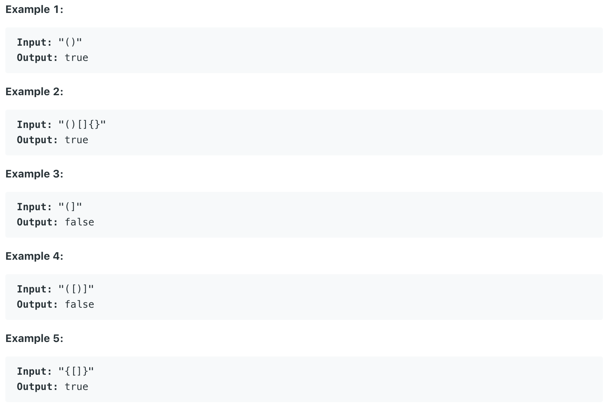

# 20.Valid Parentheses

Given a string containing just the characters `'('`, `')'`, `'{'`, `'}'`, `'['` and `']'`, determine if the input string is valid.

An input string is valid if:

1. Open brackets must be closed by the same type of brackets.
2. Open brackets must be closed in the correct order.

Note that an empty string is also considered valid.  




本题给出一个字符串，要求按以上标准判断该字符串是不是Valid Parentheses。

## 方法一：

用栈来处理该问题，若读入输入为左括号，入栈。否则，判断栈的前一位是否为当前符号的有效匹配。

```java
public boolean isValid(String s) {
        char[] stack = new char[s.length()];
        int i = 0;
        for(char c : s.toCharArray()){
            switch(c){
                case '{': stack[i++] = c; break;
                case '(': stack[i++] = c; break;
                case '[': stack[i++] = c; break;
                case '}': if( i == 0 || stack[--i] !='{') return false; break;
                case ')': if( i == 0 || stack[--i] !='(') return false; break;
                case ']': if( i == 0 || stack[--i] !='[') return false; break;
            }
        }
        return i == 0;
    }
```

**时间复杂度\(Time Complexity\) :** O\(n\)          **空间复杂度\(Space Complexity\):** O\(n\)

## 方法二：

跟上一个方法类似。区别在于该方法读入左括号，在栈中存入相应的右括号。若遇到非左括号是，则通过pop判断两个字符是否相同。

```text
public boolean isValid(String s) {
        Stack<Character> stack = new Stack<Character>();
        for(char c : s.toCharArray()){
            if(c == '('){
                stack.push(')');
            }
            else if(c == '['){
                stack.push(']');
            }
            else if(c == '{'){
                stack.push('}');
            }
            else if(stack.isEmpty() || stack.pop() != c){
                return false;
            }
        }
        return stack.isEmpty();
    }
```

**时间复杂度\(Time Complexity\) :** O\(n\)          **空间复杂度\(Space Complexity\):** O\(n\)

