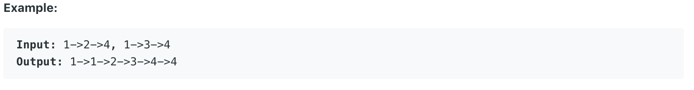

# 21.Merge Two Sorted Lists

Merge two sorted linked lists and return it as a new list. The new list should be made by splicing together the nodes of the first two lists.



本题给出两个链表，要求将他们由小到大合并成一个。

## 方法一：

递归法，每次返回一个节点，并调用下一个函数。代码实现如下：

```java
public ListNode mergeTwoLists(ListNode l1, ListNode l2) {
        if(l1 == null){
            return l2;
        }
        else if(l2 == null){
            return l1;
        }
        if(l1.val < l2.val){
            l1.next = mergeTwoLists(l1.next, l2);
            return l1;
        }
        else{
            l2.next = mergeTwoLists(l1, l2.next);
            return l2;
        }
    }
```

**时间复杂度\(Time Complexity\) :** O\(n\)          **空间复杂度\(Space Complexity\):** O\(1\)

## 方法二：

Iterative solution

```java
public ListNode mergeTwoLists(ListNode l1, ListNode l2) {
        ListNode result = new ListNode(0);
        ListNode prev = result;
        while (l1 != null && l2 != null) {
            if (l1.val <= l2.val) {
                prev.next = l1;
                l1 = l1.next;
            } else {
                prev.next = l2;
                l2 = l2.next;
            }
            prev = prev.next;
        }
        // if l1 is no null, append rest of it to the list.
        if (l1 != null) {
            prev.next = l1;
        }
        // if l2 is no null, append rest of it to the list.
        if (l2 != null) {
            prev.next = l2;
        }
        return result.next;
    }
```

**时间复杂度\(Time Complexity\) :** O\(n\)          **空间复杂度\(Space Complexity\):** O\(1\)

