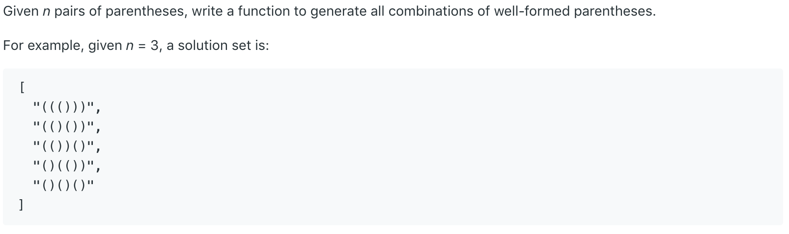
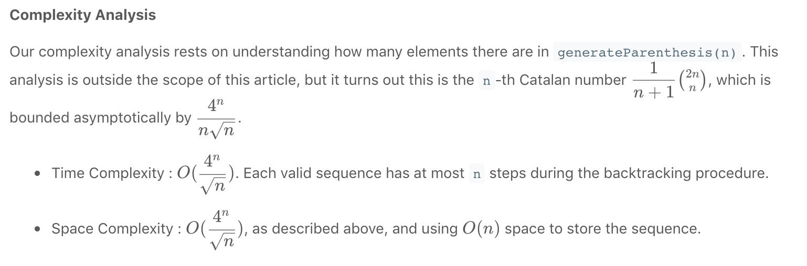

# 22.Generate Parentheses \#



本题给出一个数字N，代表N对括号。我们需要返回所有N对括号的有效组合。

## 方法一：回溯

因为有N对括号，所以最后我们返回的组合，长度都必为2N。因此我们初始化一个list，用于存储返回结果。在回溯方法中，唯有字符串str长度等于2N时，才将其加入list。通过递归，我们先添加N个左括号，然后在他们后面附上N个右括号。之后再进行回溯求其他结果。

```java
class Solution {
    public List<String> generateParenthesis(int n) {
        List<String> list = new ArrayList<>();
        backtrack(list, "", 0, 0, n);
        return list;
    }
    
    public void backtrack(List<String> list, String str, int open, int close, int max){
        if(str.length() == 2 * max){
            list.add(str);
            return;
        }
        
        if(open < max)
            backtrack(list, str + "(", open + 1, close, max);
        // Backtracking character '('
        if(close < open)
            backtrack(list, str + ")", open, close + 1, max);
    }
}
```

```text
an example to understand this solution:
(
((
(((
((()
((())
((()))
(()
(()(
(()()
(()())
(())
(())(
(())()
()
()(
()((
()(()
()(())
()()
()()(
()()()
```

时间复杂度不确定，引用LeetCode答案：



