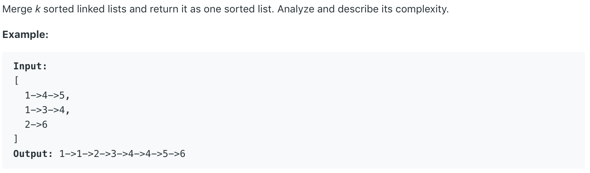

# 23.Merge k Sorted Lists

Merge _k_ sorted linked lists and return it as one sorted list. Analyze and describe its complexity.



题目给出K个list，要求合并它们并返回排好序的一个list。

## 方法一：

先合并前两个list，再逐一合并后面的list。在合并的同时进行排序。

```java
class Solution {
    // Merge lists one by one
    public ListNode mergeKLists(ListNode[] lists) {
        int n = lists.length;
        if(n == 0){
            return null;
        }
        else if(n == 1){
            return lists[0];
        }
        else if(n == 2){
            return mergeTwoLists(lists[0],lists[1]);
        }
        ListNode node = mergeTwoLists(lists[0],lists[1]);
        for(int i = 2; i < n; i++){
            node = mergeTwoLists(node,lists[i]);
        }
        return node;
    }
    
    // Method of merge two list and sort it
    public ListNode mergeTwoLists(ListNode l1, ListNode l2) {
        ListNode result = new ListNode(0);
        ListNode prev = result;
        while (l1 != null && l2 != null) {
            if (l1.val <= l2.val) {
                prev.next = l1;
                l1 = l1.next;
            } else {
                prev.next = l2;
                l2 = l2.next;
            }
            prev = prev.next;
        }
        if (l1 != null) {
            prev.next = l1;
        }
        if (l2 != null) {
            prev.next = l2;
        }
        return result.next;
    }
}
```

**时间复杂度\(Time Complexity\) :** O\(kn\)          **空间复杂度\(Space Complexity\):** O\(1\)

## 方法二：PriorityQueue

用一个Priority Queue来存储k个list的头节点。之后我们从PQ里面remove元素，附在新建的ListNode后面。每remove一个Node，就从它原本所属的list里添加一个进PQ。

```java
class Solution {
    public ListNode mergeKLists(ListNode[] lists) {
        PriorityQueue<ListNode> queue = new PriorityQueue<>((a, b) -> Integer.compare(a.val,b.val));
        // Add first node of all list to the priority queue
        for (ListNode node : lists) {
            if (node != null) {
                queue.offer(node);
            }
        }
        
        // Merge k lists starting from the dummy node.
        ListNode result = new ListNode(-1);
        ListNode dummy = result;
        
        // We remove node from the priority queue, and add it to the dummy.
        // Once we remove it from priority queue, add one back to the PQ.
        // Keep doing this util the PQ is empty.
        while (!queue.isEmpty()) {
            ListNode removed = queue.remove();
            ListNode node = new ListNode(removed.val);
            result.next = node;
            result = result.next;
            if (removed.next != null) {
                queue.offer(removed.next);
            }
        }
        return dummy.next;
    }
}
```

**时间复杂度\(Time Complexity\) :** O\(nlogk\)          **空间复杂度\(Space Complexity\):** O\(k\)

