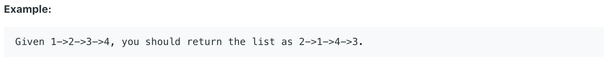

# 24.Swap Nodes in Pairs

Given a linked list, swap every two adjacent nodes and return its head.

You may **not** modify the values in the list's nodes, only nodes itself may be changed.



给出一个链表，要求交换每两个相邻的Node。

## 方法一：

从头开始遍历链表，逐个调换相邻的两个节点。

```java
class Solution {
    public ListNode swapPairs(ListNode head) {
        ListNode node = new ListNode(0);
        node.next = head;
        ListNode dummy = node;
        
        while(node.next != null && node.next.next != null){
            //Nodes for store real nodes in the linked list
            ListNode first = node.next;
            ListNode second = node.next.next;
            
            //Swap pair nodes
            first.next = second.next;
            node.next = second;
            node.next.next = first;
            node = node.next.next;
        }
        return dummy.next;
    }
}
```

**时间复杂度\(Time Complexity\) :** O\(n\)          **空间复杂度\(Space Complexity\):** O\(1\)

## 方法二：

同一个方法的递归写法。

```text
class Solution {
    public ListNode swapPairs(ListNode head) {
        if ((head == null)||(head.next == null))
            return head;
        ListNode n = head.next;
        head.next = swapPairs(head.next.next);
        n.next = head;
        return n;
    }
}
```

**时间复杂度\(Time Complexity\) :** O\(n\)          **空间复杂度\(Space Complexity\):** O\(\)

