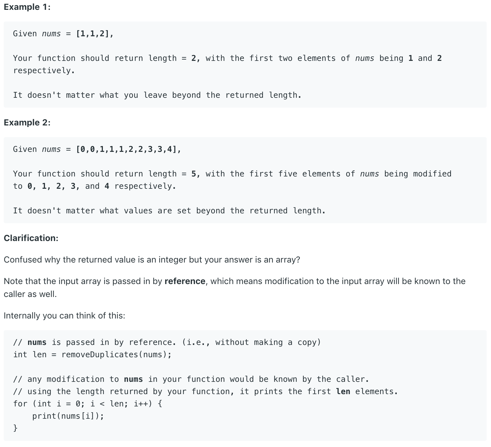

# 26.Remove Duplicates from Sorted Array \#

Given a sorted array _nums_, remove the duplicates [**in-place**](https://en.wikipedia.org/wiki/In-place_algorithm) such that each element appear only _once_ and return the new length.

Do not allocate extra space for another array, you must do this by **modifying the input array** [**in-place**](https://en.wikipedia.org/wiki/In-place_algorithm) with O\(1\) extra memory.



## 方法一：

利用快慢指针，i 指针从 0 开始，j 指针从 1 开始，如果 i 和 j 所指数字相等，就一直后移 j 。如果不相等，i 指针后移一位用来保存当前 j 所指的值，然后继续回到 j 的后移中去。

```text
class Solution {
    public int removeDuplicates(int[] nums) {
        // Two pointer's solution
        // i is a slow pointer while j is a fast pointer
        // We compare elements of these two pointer point to
        int i = 0;
        for(int j = 0; j < nums.length; j++){
            // If their value is different, we increase i's value and copy the element of j to i
            if(nums[i] != nums[j]){
                i++;
                nums[i] = nums[j];
            }
        }
        return i + 1;
    }
}
```

**时间复杂度\(Time Complexity\) :** O\(n\)          **空间复杂度\(Space Complexity\):** O\(1\)

