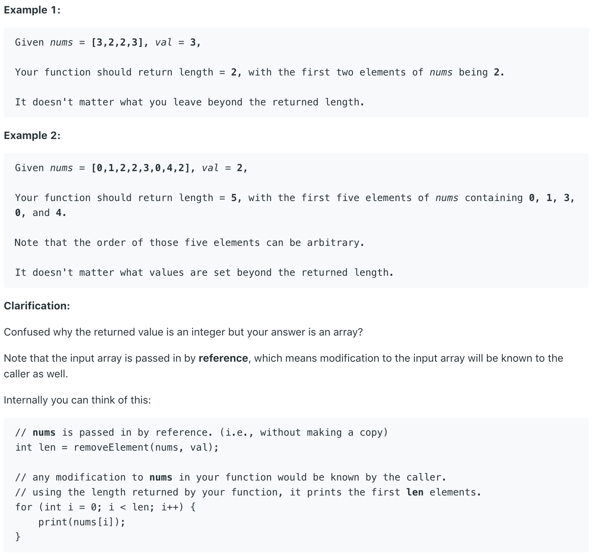

# 27.Remove Element \#

Given an array _nums_ and a value _val_, remove all instances of that value [**in-place**](https://en.wikipedia.org/wiki/In-place_algorithm) and return the new length.

Do not allocate extra space for another array, you must do this by **modifying the input array** [**in-place**](https://en.wikipedia.org/wiki/In-place_algorithm) with O\(1\) extra memory.

The order of elements can be changed. It doesn't matter what you leave beyond the new length.



本题给出一个int型数组和一val的值。要求返回删除所有值为val的elements后，数组的长度。

## 方法一：

定义快慢指针。如果快指针指向的值不等于val，那么将快指针指向的值拷贝到慢指针指向的值。否则直接跳过。最后放回慢指针的索引，就是所求长度。

```text
class Solution {
    public int removeElement(int[] nums, int val) {
        // Tis is a two pointers solution
        // i is slow pointer when j is the fast pointer
        // if j's value is val, skip it. Otherwise copy it to the front
        int i = 0;
        for(int j = 0; j < nums.length; j++){
            if(nums[j] == val)
                continue;
            else{
                nums[i] = nums[j];
                i++;
            }
        }
        return i;
    }
}
```

**时间复杂度\(Time Complexity\) :** O\(n\)          **空间复杂度\(Space Complexity\):** O\(1\)

