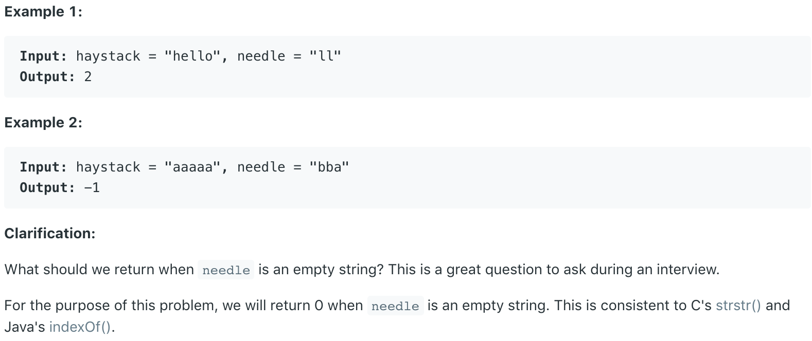

# 28.Implement strStr\(\) \#

Implement [strStr\(\)](http://www.cplusplus.com/reference/cstring/strstr/).

Return the index of the first occurrence of needle in haystack, or **-1** if needle is not part of haystack.



本题要求实现Java里的indexOf\(\)方法。既给出两个字符串，求一个字符串在另一个字符串中第一次发生的位置。

## 方法一：

用两个for循环去遍历haystack字符串，看是否包含needle字符串。有则返回其出现位置，没有则返回-1。

```java
class Solution {
    public int strStr(String haystack, String needle) {
        for (int i = 0; ; i++) {
            for (int j = 0; ; j++) {
              if (j == needle.length()) return i;
              if (i + j == haystack.length()) return -1;
              if (needle.charAt(j) != haystack.charAt(i + j)) break;
             }
        }
    }
}
```

**时间复杂度\(Time Complexity\) :** O\(n^2\)          **空间复杂度\(Space Complexity\):** O\(1\)

