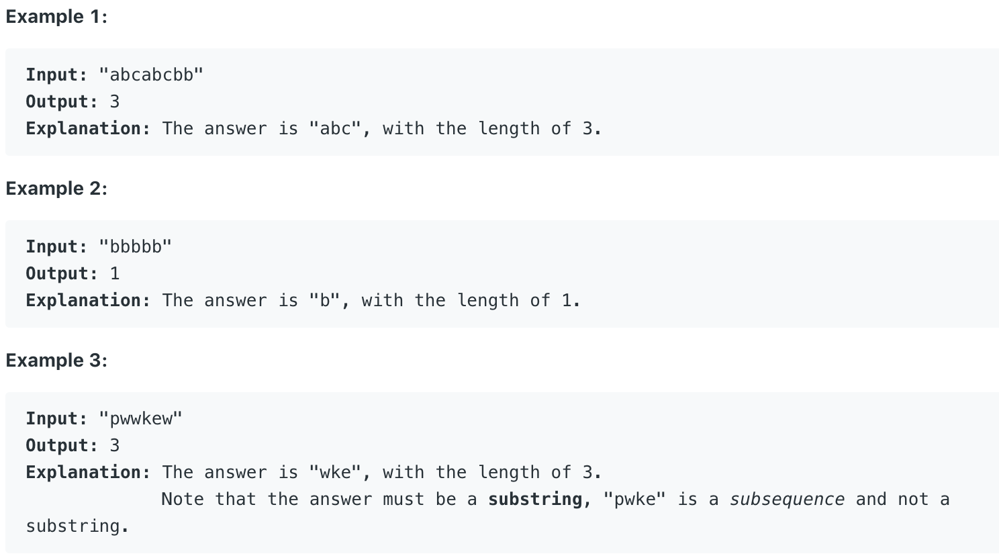

# 3.Longest Substring Without Repeating Characters \#

Given a string, find the length of the **longest substring** without repeating characters.



本题给出一个字符串，要求求出最长的不存在重复字符的子字符串。

## 方法一：**Sliding Window**

使用两个指针和HashMap进行长度计算。两个指针分别指向子字符串的开头与末尾。通过逐步移动右侧指针，将整个子字符串逐步加入Hash Map之中。每移动一次右指针，子字符串长度加一。若子字符串中出现重复字符，停止向Hash Map中添加该字符。并将左指针指向当前子字符串的末端，以用于检测下一个字符串。

```text
public int lengthOfLongestSubstring(String s) {
        /**the basic idea is, keep a hashmap which stores the characters
         in string as keys and their positions as values, and keep two 
         pointers which define the max substring. move the right pointer 
         to scan through the string , and meanwhile update the hashmap. 
         If the character is already in the hashmap, then move the left 
         pointer to the right of the same character last found. 
         Note that the two pointers can only move forward.*/
        if (s.length()==0) return 0;
        HashMap<Character, Integer> map = new HashMap<Character, Integer>();
        int max=0;
        for (int i=0, j=0; i<s.length(); i++){
            if (map.containsKey(s.charAt(i))){
                j = Math.max(j,map.get(s.charAt(i))+1);
            }
            map.put(s.charAt(i),i);
            max = Math.max(max,i-j+1);
        }
        return max;
    }
```

**时间复杂度\(Time Complexity\) :** O\(n\)          **空间复杂度\(Space Complexity\):** O\(min\(m, n\)\) 

\*n为字符串s的长，m为charset/alphabet的大小

Runtime: **7 ms**                                                  Memory Usage: **37 MB**


