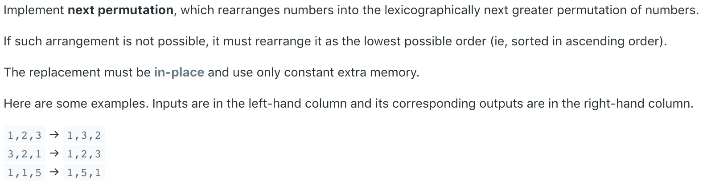

# 31.Next Permutation \#



题目的意思是给定一个数，然后将这些数字的位置重新排列，得到一个刚好比原数字大的一种排列。如果没有比原数字大的，就升序输出（既输出最小的那个排列）。

## 方法一：

为了使当前数字更大，我们需要找到一位数，让其与其右侧比它大的位数交换。这样才能够获得更大的值。若右边不止一位数比当前位数大，则选择刚好比它大那一位进行交换。由此保证得来结果相对较小。交换完以后，我们还将对交换位之后的所有元素进行升序排序，由此保证最后得到的一定是大于当前排列数的最小排列数。由于之后的元素已经符合降序排列，所以我们只需要进行元素交换即可完成升序排序，不需要调用排序函数。

参考链接：[https://leetcode.wang/leetCode-31-Next-Permutation.html](https://leetcode.wang/leetCode-31-Next-Permutation.html)


```java
class Solution {
    public void nextPermutation(int[] nums) {
        // Finding First Decreasing element
        int i = nums.length - 2;
        while (i >= 0 && nums[i + 1] <= nums[i]) {
            i--;
        }
        if (i >= 0) {
            // Finding element just greater than the first decreasing element
            int j = nums.length - 1;
            while (j >= 0 && nums[j] <= nums[i]) {
                j--;
            }
            // Swap two element
            swap(nums, i, j);
        }
        // Reverse rest of the array
        reverse(nums, i + 1);
    }
    
    private void reverse(int[] nums, int start) {
        int i = start, j = nums.length - 1;
        while (i < j) {
            swap(nums, i, j);
            i++;
            j--;
        }
    }
    
    private void swap(int[] nums, int i, int j) {
        int temp = nums[i];
        nums[i] = nums[j];
        nums[j] = temp;
    }
    
}
```

**时间复杂度\(Time Complexity\) :** O\(n^2\)          **空间复杂度\(Space Complexity\):** O\(1\)

