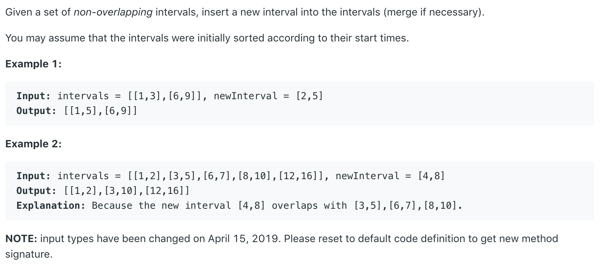

# 43.Multiply Strings \#



本题给出两个非负的整数数组，要求已字符串的形式返回他们的乘积。

## 方法一：

就像我们做乘法竖式运算一样，逐位相乘。将中间结果保存在一个pos数组中，最后将这个数组append到StringBuilder里，再以String格式输出。


```java
class Solution {
    public String multiply(String num1, String num2) {
        int m = num1.length();
        int n = num2.length();
        int[] pos = new int[m + n];
        for(int i = m - 1; i >= 0; i--){
            for(int j = n - 1; j >= 0; j--){
                int mul = (num1.charAt(i) - '0')*(num2.charAt(j) - '0');//Get result at that bit
                int p1 = i + j;
                int p2 = i + j + 1;
                int sum = mul + pos[p2]; //加上进位
                pos[p1] = pos[p1] + sum/10; //进位
                pos[p2] = sum % 10; //本位
            }
        }
        StringBuilder sb = new StringBuilder();
        for(int p : pos){
            if(!(sb.length() == 0 && p == 0)) //防止第一位为0
                sb.append(p);
        }
        return sb.length() == 0 ? "0" : sb.toString();
    }
}
```

**时间复杂度\(Time Complexity\) :** O\(m\*n\)          **空间复杂度\(Space Complexity\):** O\(m+n\)

## 参考链接：






