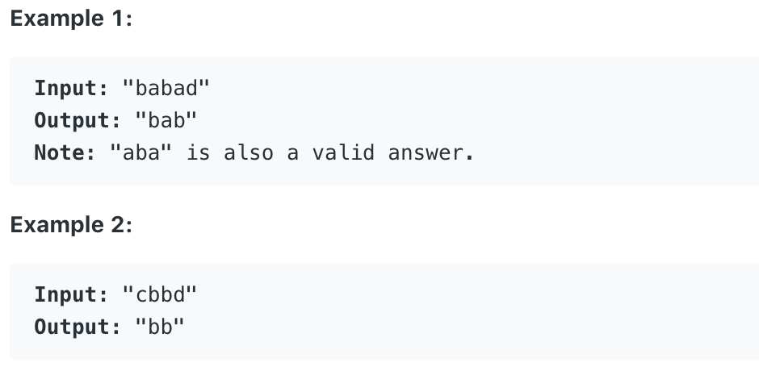

# 5.Longest Palindromic Substring \#

Given a string **s**, find the longest palindromic substring in **s**. You may assume that the maximum length of **s** is 1000.



本题给出一个最长为1000的字符串，要求求出最长的子回文字符串。

## 方法一：**Dynamic Programming**

使用一个boolean型的二维数组dp\[\]\[\]来表示从start位置到end位置的子字符串是否为回文片段。用boolean变量equal来表示当前字符串的首位字符与末位字符是否相等。用int型变量max\_len和 max\_pal分别记录当前所取得最长回文子序列的长和子字符串的值。初始化所有dp\[i\]\[i\]为true，因为单一字符一定是回文片段。当字符串长度为1或2时，它也必定是回文片段。因此状态转移方程可写作 dp\[start\]\[end\] = \(len == 1 \|\| len == 2 \|\| dp\[start + 1\]\[end - 1\]\) && equal。如果当前子字符串符合回文序列，并且其长度比之前取得的max\_len要长，那么将len赋值给max\_len，并将当前子字符串赋值给max\_pal。

```text
public String longestPalindrome(String s) {
        int n = s.length();
        boolean[][] dp = new boolean[n][n];
        int max_len = 0;
        String max_pal = "";
        boolean equal;
        for(int len = 1; len <= n; len++){
            for(int start = 0; start < n; start++){
                int end = start + len - 1;
                if(end >= n)
                    break;
                equal = s.charAt(start) == s.charAt(end);
                dp[start][end] = (len == 1 || len == 2 || dp[start + 1][end - 1]) && equal;
                if(dp[start][end] && len > max_len){
                    max_len = len;
                    max_pal = s.substring(start, end + 1);
                }
            }
        }
        return max_pal;
```

**时间复杂度\(Time Complexity\) :** O\(n^2\)          **空间复杂度\(Space Complexity\):** O\(n^2\)

Runtime: **89 ms**                                                  Memory Usage: **39 MB**

