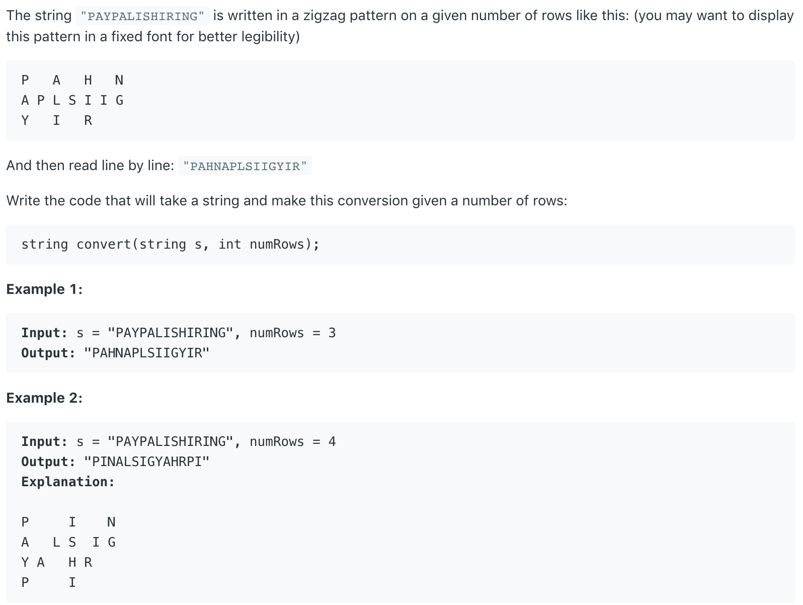

# 6.ZigZag Conversion \#



本题给出一个字符串，要求以ZigZag格式将其输出

## 方法一：

创建一个StringBuilder数组，其长度等于行数。该数组的每一个element用于储存它所对应的行的的内容。随后，遍历数组，并从上到下，斜向上的顺序储存到数组中。最后，将数组中的每一个元素附在第一个后面。

```text
public String convert(String s, int numRows) {
        char[] c = s.toCharArray();
        int len = c.length;
        
        // Initialize StringBuilder Array. Each element of the array is the content  of each row
        StringBuilder[] sb = new StringBuilder[numRows];
        for (int i = 0; i < sb.length; i++) 
            sb[i] = new StringBuilder();

        // Build ZigZag Order to StringBuilder Array
        int i = 0;
        while (i < len) {
            for (int idx = 0; idx < numRows && i < len; idx++) // vertically down
                sb[idx].append(c[i++]);
            for (int idx = numRows-2; idx >= 1 && i < len; idx--) // obliquely up
                sb[idx].append(c[i++]);
        }
        
        // Append all the content to one row
        for (int idx = 1; idx < sb.length; idx++)
            sb[0].append(sb[idx]);
        
        return sb[0].toString();
    }
```

**时间复杂度\(Time Complexity\) :** O\(n\)          **空间复杂度\(Space Complexity\):** O\(n\)

Runtime: **5 ms**                                                  Memory Usage: **38.7 MB**

