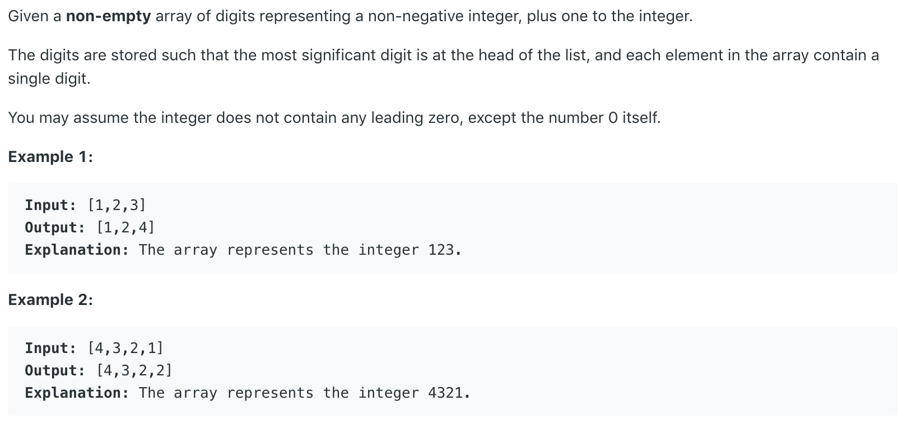

# 66.Plus One



本题给出一个字符串，需要我们往最后一位数字加一。若遇到9的情况，加一后需要进位。

## 方法一：

迭代法，从后往前加。若当数字为9，继续往前，否则返回数组。若迭代到了数组开头，且进位不为0，则创建一个长度比原来数组长1的新数组，令新数组的第一个元素为1.

```text
class Solution {
    public int[] plusOne(int[] digits) {
        for(int i = digits.length-1; i>=0; i--){
            if(digits[i] == 9)
                digits[i] = 0;
            else{
                digits[i] = digits[i] + 1;
                return digits;
            }
        }
        int[] result = new int [digits.length+1];
        result[0] = 1;
        return result;
    }
}
```

**时间复杂度\(Time Complexity\) :** O\(n\)          **空间复杂度\(Space Complexity\):** O\(n\)

