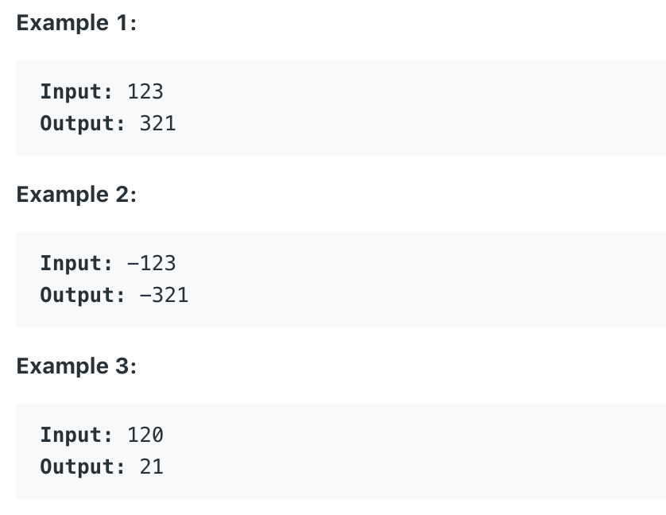

# 7.Reverse Integer

Given a 32-bit signed integer, reverse digits of an integer.



本题给出一个整数，要求反向输出它。

## 方法一：

对整数x，不断取10的除数，并赋值给它本身， 直至x为0。每次循环以10\*result\(提高位数\)，加上 x % 10取得的x最低位。\(temp - last\)/10 != result用于防止溢出。

```text
public int reverse(int x) {
        int temp = 0;
        while(x != 0){
            int last = x%10;
            int result = temp*10 + last;
            if((result-last)/10 != temp){
                return 0;
            }
            temp = result;
            x = x/10;
        }
        return temp;
}
```

**时间复杂度\(Time Complexity\) :** O\(log\(n\)\)          **空间复杂度\(Space Complexity\):** O\(1\)

Runtime: **14 ms**                                                  Memory Usage: **24.1 MB**

## 方法二：

与方法一原理相同。不同之处在于，我们通过long类型来储存返回值，这样即便值溢出，也能够被成功储存。相比方法一中每次循环中判断一次是否溢出，方法二仅最后在返回之前，做一次是否溢出的判断。通过减少判断溢出的次数，来加快运行速度。

```text
public int reverse(int x) {
        long answer = 0;
        while(x != 0) {
            answer = 10 * answer + x % 10;
            x /= 10;
        }
        return (answer > Integer.MAX_VALUE || answer < Integer.MIN_VALUE) ? 0 : (int) answer;
}
```

**时间复杂度\(Time Complexity\) :** O\(log\(n\)\)          **空间复杂度\(Space Complexity\):** O\(1\)

Runtime: **1 ms**                                                  Memory Usage: **32.9 MB**

