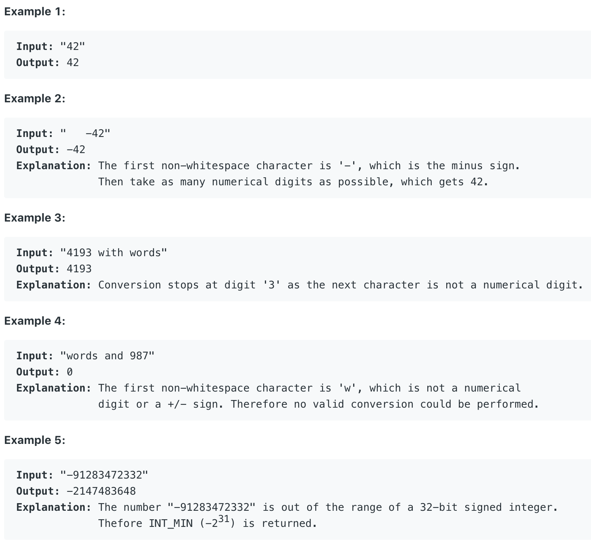

# 8.String to Integer \(atoi\) \#

Implement `atoi` which converts a string to an integer.

The function first discards as many whitespace characters as necessary until the first non-whitespace character is found. Then, starting from this character, takes an optional initial plus or minus sign followed by as many numerical digits as possible, and interprets them as a numerical value.

The string can contain additional characters after those that form the integral number, which are ignored and have no effect on the behavior of this function.

If the first sequence of non-whitespace characters in str is not a valid integral number, or if no such sequence exists because either str is empty or it contains only whitespace characters, no conversion is performed.

If no valid conversion could be performed, a zero value is returned.



将输入字符串转化为整数，若开头为空格，跳过所有空格。若第一个非空格的字符为非数字/正负号，返回无效值0。若字符串所代表的值溢出了整数范围，返回整数的最小或最大值。

## 方法一：

用一个sign变量记录正负号。先跳过开头的所有空白字符，从第一位非空白字符开始判断。若第一位符号为正负号，则对sign变量赋值。接着扫描剩余的所有字符，若剩余第一位不是数字，返回0。否则将total放大十倍以后再加上。Integer.MAX\_VALUE / 10 &lt; total 和 Integer.MAX\_VALUE /10 == total && Integer.MAX\_VALUE %10 &lt; digit 用于溢出判断。 判断将total放大十倍以后会不会发生溢出，若会溢出，则直接根据sign返回Integer.MAX\_VALUE/Integer.MIN\_VALUE。

```text
public int myAtoi(String str) {
        int len = str.length();
        //Handle empty string
        if(len == 0)
            return 0;
        
        int i = 0, sign = 1, total = 0, digit = 0;
        
        //Remove front whitespaces
        while(i < len && str.charAt(i) == ' '){
            i++;
            if(i >= len)
                return 0;
        }
        
        //Assign sign
        if(str.charAt(i) == '+' || str.charAt(i) == '-'){
            sign = str.charAt(i) == '+' ? 1 : -1;
            i++;
        }
        
        //Convert char to int and detect overflow
        while(i < len){
            digit = str.charAt(i) - '0';
            if(digit < 0 || digit > 9)
                break;
            if(Integer.MAX_VALUE / 10 < total){
                return sign == 1 ? Integer.MAX_VALUE : Integer.MIN_VALUE;
            }
            else if(Integer.MAX_VALUE / 10 == total && Integer.MAX_VALUE % 10 < digit){
                return sign == 1 ? Integer.MAX_VALUE : Integer.MIN_VALUE;
            }
            total = 10 * total + digit;
            i++;
        }
        
        return sign * total;
    }
```

**时间复杂度\(Time Complexity\) :** O\(\)          **空间复杂度\(Space Complexity\):** O\(1\)

Runtime: **1 ms**                                                  Memory Usage: **35.2 MB**

