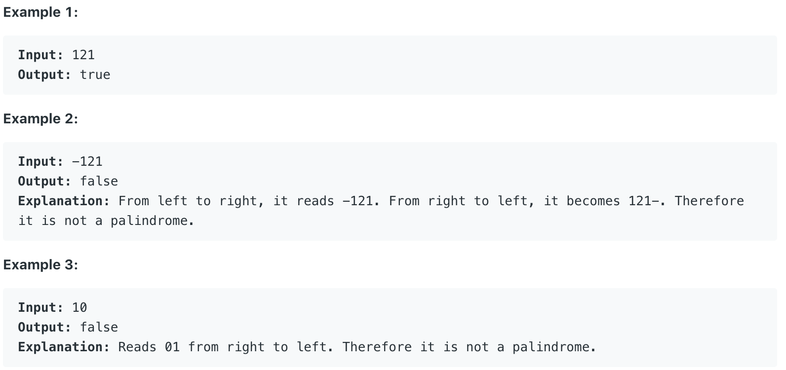

# 9.Palindrome Number

Determine whether an integer is a palindrome. An integer is a palindrome when it reads the same backward as forward.



本题输入一个数字，要求判断该数字是不是回文数字。

## 方法一：

该方法参考了第七题 Reverse Integer中的方法一，先对数字进行翻转，若翻转后结果与原输入相同，则可判断该数字为回文数字。

```text
public boolean isPalindrome(int x) {
    int input = x;
    
    //Return false if x is negative
    if(x < 0){
        return false;
    }
        
    int result = 0;

    //Get x's reverse number
    while (x != 0){
        int tail = x % 10;
        int newResult = result * 10 + tail;
        if ((newResult - tail) / 10 != result){ return false; }
        result = newResult;
        x = x / 10;
    }
        
    //Check wether x is palindrome
    if (input == result){
        return true;
    }
    else{
        return false;
    }
}
```

**时间复杂度\(Time Complexity\) :** O\(log\(n\)\)          **空间复杂度\(Space Complexity\):** O\(1\)

Runtime: **79 ms**                                                  Memory Usage: **27.4 MB**

## 方法二：

其实本方法并不算第二种方法，因为它与方法一本质上一样，但是运行速度快上许多。应该是Leetcode网站提交运行的机制有关.....

```text
public boolean isPalindrome(int x) {
    int input = x, result = 0, check = 0;
    
    //Return false if x is negative    
    if(x < 0){
        return false;
    }

    //Get x's reverse number
    while (x != 0){
        int tail = x % 10;
        check = result * 10 + tail;
        if ((check - tail) / 10 != result){ return false; }
        result = check;
        x = x / 10;
    }
        
    //Check wether x is palindrome
    if (input == result){
        return true;
    }
    else{
        return false;
    }        
}
```

**时间复杂度\(Time Complexity\) :** O\(log\(n\)\)          **空间复杂度\(Space Complexity\):** O\(1\)

Runtime: **6 ms**                                                  Memory Usage: **34.8 MB**

