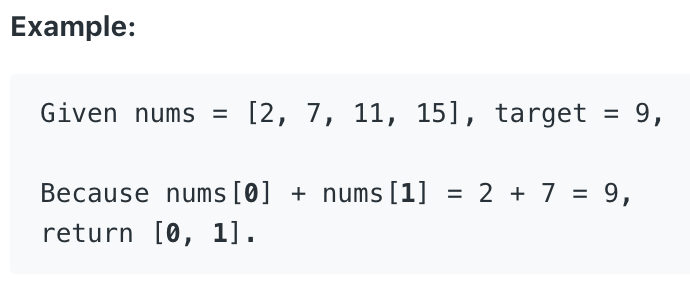

# 1.Two Sum

Given an array of integers, return **indices** of the two numbers such that they add up to a specific target.

You may assume that each input would have _**exactly**_ one solution, and you may not use the _same_ element twice.



本题给出一个一维数组\(nums\)和一个目标数字\(target\)，要求在nums中找出两个和为target的数字，并返回他们的索引。数组中每个element只能用一次，且假设只有一种解。

## 方法一：暴力法（Brute-Froce）

初始化一个数组长度为2的数组，以及两个指针。用两个指针去遍历数组，如果两个指针指向的两个数之和为target的值，将指针的值赋值给数组，并返回整个数组。

```text
public int[] twoSum(int[] nums, int target) {
    int[] a = new int[2];
    int i,j;
    for(i = 0; i < nums.length; i++)
        for(j = 0; j < nums.length; j++)
            if(nums[i] + nums[j] == target & i != j) {
                a[0] = i;
                a[1] = j;
                return a;
            }
    return a;
}
```

**时间复杂度\(Time Complexity\) :** O\(n^2\).          **空间复杂度\(Space Complexity\):** O\(1\).

 Runtime: **83 ms**                                                  Memory Usage: **25.3 MB**

## Can we do better?

暴力法的问题在于，对于每个element，我们都需要O\(n\)的时间去遍历其他element。以此来寻找是否存在其他element，使两个element之和等于target。针对此类问题，我们可使用Hash Table来进行算法优化。\(HashTable查找一个特定的Key耗时为O\(1\).\)

## 方法二：Hash Table法

同样，先定义一个长为2的一维数组用于返回索引。用一个Hash Table来储存数组nums中所有的数以及他们的索引。将nums的值所谓Hash Table的key，索引作为value。往Hash Table中插入值的同时，寻找是否有其他key与当前key相加的值为target。一旦找到，将连个key赋值给数组，返回数组。

```text
public int[] twoSum(int[] nums, int target) {
        int[] result = new int[2];
        Map<Integer,Integer> map = new HashMap<Integer,Integer>();
        for(int i = 0; i < nums.length; i++){
            map.put(nums[i], i);
            if(map.containsKey(target-nums[i])){
                result[1] = i ;
                result[0] = map.get(target-nums[i]);
                return result;
            }
        }
        return result;
    }
```

**时间复杂度\(Time Complexity\) :** O\(n\).          **空间复杂度\(Space Complexity\):** O\(n\).

Runtime: **2 ms**                                                  Memory Usage: **37.8 MB**

